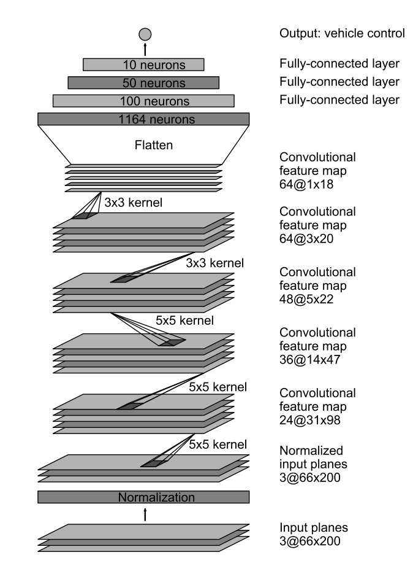
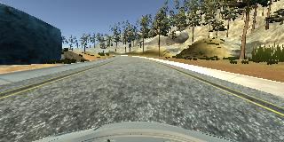
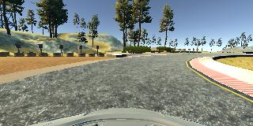
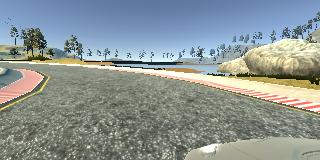
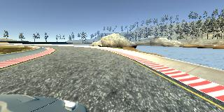
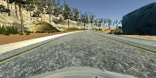
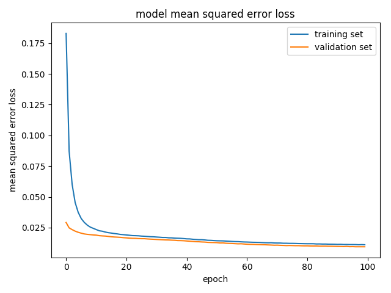

# **Behavioral Cloning** 

## Writeup

---

**Behavioral Cloning Project**

The goals / steps of this project are the following:
* Use the simulator to collect data of good driving behavior
* Build, a convolution neural network in Keras that predicts steering angles from images
* Train and validate the model with a training and validation set
* Test that the model successfully drives around track one without leaving the road
* Summarize the results with a written report

---
### How to run

This project requires [CarND Term1 Starter Kit](https://github.com/udacity/CarND-Term1-Starter-Kit)

My project includes the following files:
* model.py containing the script to create and train the model
* drive.py for driving the car in autonomous mode
* model.h5 containing a trained convolution neural network 
* README.md summarizing the results
* getdata.sh download and unzip the data sets

Using the [Udacity provided simulator](https://github.com/udacity/self-driving-car-sim) and drive.py file, the car can be driven autonomously around the track by executing 
```sh
python drive.py model.h5
```

The model.py file contains the code for training and saving the convolution neural network. The file shows the pipeline I used for training and validating the model, and it contains comments to explain how the code works.

### Model Architecture 

#### 1. Chosen architecture

I used a convolution neural network similar to [the network proposed by NVIDIA](http://images.nvidia.com/content/tegra/automotive/images/2016/solutions/pdf/end-to-end-dl-using-px.pdf). 



This model consists of three convolution layers with filter sizes of 5x5, stride of 2x2, and depths of 24, 36, and 48. The network has two more convolution layers with the filter size of 3x3, stride of 1x1, and depth 64 and 64. Following the convolution layers, three fully-connected layers with 100,50, and 10 neurons are added. def_model function in model.py lines 88-112 defines the model. 

##### preprocessing
The car camera image size is 160x320 which contains the whole scene including sky, trees, and hood of the car. Therefore, I added a cropping layer using a Keras lambda layer to lower down the number of parameters and remove the unuseful data. this layer cuts 60 pixels from the top, and 25 pixels from the bottom of images, resulting a 75x320 pixels image.

Contrary to the original architecture, I stick with the RGB image, since i thought it would give a similar result as YUV color space.

Moreover, the images are normolized using a Lambda layer to prevent the weights and biases from getting too big or too small; therefore, it will help the optimizer to find the numerical solution faster.

#### 2. Approach

The overall strategy for deriving a model architecture was to fine tune an existing network to control steering angle similar to the human drive.

My first step was to use a convolution neural network model similar to the [NVIDIA paper network](http://images.nvidia.com/content/tegra/automotive/images/2016/solutions/pdf/end-to-end-dl-using-px.pdf). I thought this model might be appropriate because according to the paper, this model performed well at detecting the lane lines and staying in the road with minimum number of intervention.

Also, I added ELU activation function to each layer to introduce non-linearity to the model.

In order to gauge how well the model was working, I split my image and steering angle data into a training and validation set. I found that my first model had a low mean squared error on the training set but a high mean squared error on the validation set. This implied that the model was overfitting. 

##### Attempts to reduce overfitting in the model
To combat the overfitting, I added dropout layers to the model after each convolution layer. Also, the fully-connected layers are followed by dropout layers as well; however, the dropout rate for these layers gets less by closing up to the output layer. I found out this works better during the training since the number of weights are smaller toward the end compare to the begining of the model, and the model can't afford to loose too many of the trained weights. increasing the dropout rate would decrease the chance of overfitting; the number of epochs, however, should increase.

The model was trained and validated on different data sets to ensure that the model was not overfitting (code line 84-85).

The final step was to run the simulator to see how well the car was driving around track one. At the sharp turns, although the vehicle stayed on the road, it performed poorly and made turn when it almost off the road. To improve the driving behavior in these cases, I collected some more data focusing on challenging turns which it will be explained in the next section.

Also, I used Keras EarlyStopping callback to stop the training before the model overfits the training set. this callback watches the validation loss to determine when stop the training.

At the end of the process, the vehicle is able to drive autonomously around the track without leaving the road. the output images from the front facing center camera are in <a href="./testdrive.zip">testdrive.zip</a>. <a href="./testdrive.mp4">testdrive.mp4</a> is generated based on these images. Also, I captured the simulator which is available on <a href="https://youtu.be/Wt54kD0Rlsc">youtube</a>.

#### 3. Final Architecture


| Layer (type)               |  Output Shape            |  Param #  | 
|:--------------------------:|:------------------------:|:---------:|
| cropping2d_1 (Cropping2D)  |  (None, 75, 320, 3)      |  0        | 
| lambda_1 (Lambda)          |  (None, 75, 320, 3)      |  0        | 
| conv2d_1 (Conv2D)          |  (None, 36, 158, 24)     |  1824     | 
| dropout_1 (Dropout)        |  (None, 36, 158, 24)     |  0        | 
| conv2d_2 (Conv2D)          |  (None, 16, 77, 36)      |  21636    | 
| dropout_2 (Dropout)        |  (None, 16, 77, 36)      |  0        | 
| conv2d_3 (Conv2D)          |  (None, 6, 37, 48)       |  43248    | 
| dropout_3 (Dropout)        |  (None, 6, 37, 48)       |  0        | 
| conv2d_4 (Conv2D)          |  (None, 4, 35, 64)       |  27712    | 
| dropout_4 (Dropout)        |  (None, 4, 35, 64)       |  0        | 
| conv2d_5 (Conv2D)          |  (None, 2, 33, 64)       |  36928    | 
| dropout_5 (Dropout)        |  (None, 2, 33, 64)       |  0        | 
| flatten_1 (Flatten)        |  (None, 4224)            |  0        | 
| dense_1 (Dense)            |  (None, 100)             |  422500   | 
| dropout_6 (Dropout)        |  (None, 100)             |  0        | 
| dense_2 (Dense)            |  (None, 50)              |  5050     | 
| dropout_7 (Dropout)        |  (None, 50)              |  0        | 
| dense_3 (Dense)            |  (None, 10)              |  510      | 
| dropout_8 (Dropout)        |  (None, 10)              |  0        | 
| dense_4 (Dense)            |  (None, 1)               |  11       | 

Total params: **559,419**

Trainable params: **559,419**

Non-trainable params: **0**


### Training Strategy

#### 1. Creation of the Training Set

To capture good driving behavior, I used [the data provided by the Udacity](https://d17h27t6h515a5.cloudfront.net/topher/2016/December/584f6edd_data/data.zip); also, I recorded one lap on track one  and I tried to include some recovery situations since the data set collected by driving in center of the road is pretty unbalanced and would cause ungenerilzed model which is not trained how to recover from drifting to left or right. Here is an example image of center lane driving:



Because driving counter clockwise around the track one mostly contains left turns, I then drove the vehicle clockwise and recorded the data, so the network also learns how to deal with the right turns. Here is an example image of the driving in the reverse direction.



Moreover, the simulated car is equipped with three cameras, one to the left, one in the center and one to the right of the driver that provide images from these different view points. To teach the network how to recover from left or right side of the road back to center, I used the image from left and right camera with a correction offset. this way if these images are seen from the center camera, the vehicle is pushed back to the center. Here are examples of images from the left and right cameras.





To augment the data sat, I also flipped images and angles thinking that this would generlize the data set. For example, here is an image that has then been flipped:



At this point the vehicle successfully could complete the lap around the track one, meaning it stayed at the center of road, followed the road at turns, and recoverd back to center after wandering off. However, as i mentioned before, still at sharp turns, vehicle did poorly. This time, I just recorded driving on the challenging turns focusing on turning a bit early to get the smooth turn.

After the collection process, I had 65088 number of data points. The data is preproccessed using the method described in the previous section.

#### 2.  Training Process

I finally randomly shuffled the data set and put 20% of the data into a validation set. 

The model used an adam optimizer with learning rate of 1.0e-4, so the learning rate was not tuned manually (model.py line 111).

As the problem is to steer the vehicle like human driver, it can be stated as a **supervised regression** problem. Therefore, the best loss function is mean square error between output of the network and steering angle of the collected data set.

I used this training data for training the model. The validation set helped determine if the model was over or under fitting. The ideal number of epochs was 50 as evidenced by the training and validation loss are depicted in the picture below. I trained the network for 100 epochs just for the sake of demonstration; however, with 50 epochs the network shows good performance on the test. Also, as it can be seen in the figure below, the training and validation loss are at the same range, indicating the model doesn't over/underfit.




```python

```
